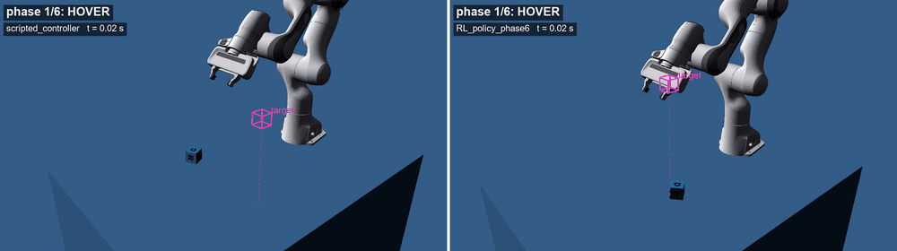
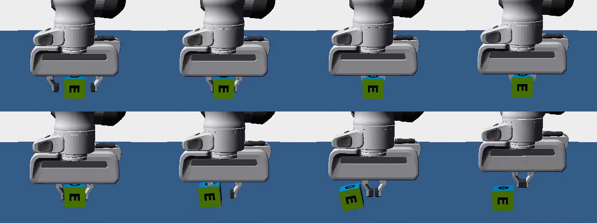
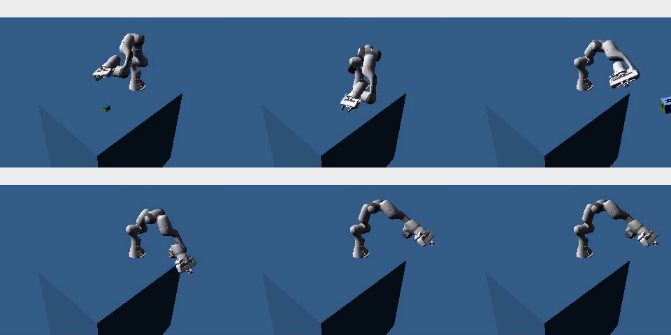
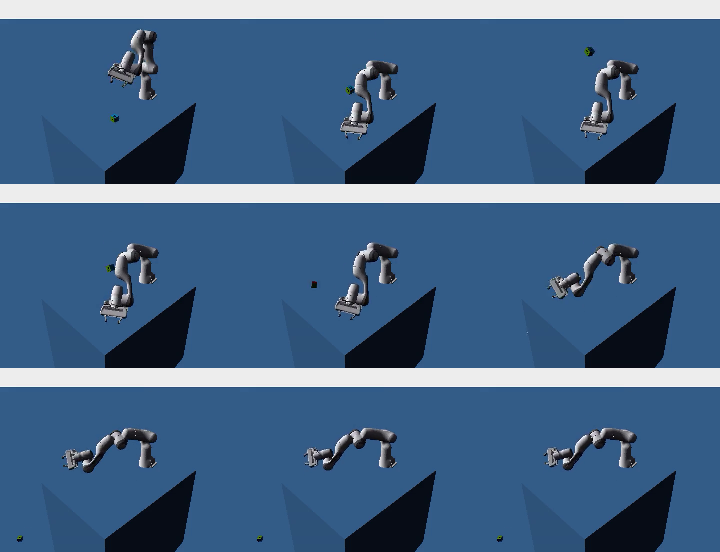
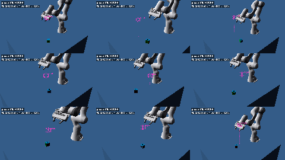

# franka-arm-rl

**My first reinforcement-learning manipulation project:** a Franka Panda arm learns, with PPO, to pick up a cube from a
random position and rotation and carry it to a random point in the air, even when the cube's weight and friction
change every episode. Trained in Isaac Lab 3.0 (Newton / MuJoCo-Warp physics) on one laptop GPU (RTX 4060, 8 GB).

*Left: a hand-written controller. Right: the trained RL policy. Both pick the cube up and hold it in the target box,
and the trained policy gets there in about half the time. (Two random episodes; click for the full 8 s video.)*

| final policy, everything randomized | success (cube within 3 cm of target) | clean grasp | table hits | median distance to target |
|---|---|---|---|---|
| 1,000 test episodes | **99.5 %** | **99.6 %** | 0.3 % | **1.24 mm** |

This repo is a record of the work: results, videos, figures and code. Full numbers are in [RESULTS.md](RESULTS.md),
and every video is described in [videos/INDEX.md](videos/INDEX.md).

---

## The journey

It took three attempts over three days (28–30 Sep 2026). The first two failed, and those failures taught me the most.

### Attempt 1: the stock task, and the robot that cheated
I started from Isaac Lab's built-in "Franka lift cube" task and switched it to the Newton physics engine. Two problems:
- **The physics couldn't grasp.** With Newton's default contact settings, the fingers sank into the cube and slid off.
  A hand-written grasp lifted the cube **0 out of 64** times. Stiffer contacts, more physics substeps and finger armature fixed it.

  
- **Then the policy found shortcuts.** The stock reward pays whenever the cube is up and near the target, not for how
  it got there. PPO learned to swipe the cube, launch it, and finally to **lunge past the cube, slam the table and rake
  it back** into the fingers. The metrics said "99.5 % lift". The videos showed a robot hitting the table in 90 % of
  episodes. **Lesson: always watch the videos, up close.**

   

### Attempt 2: a staged reward, and a gripper that never closed
I rewrote the reward as stages: hover → descend slowly → grasp → lift → carry. The rake disappeared, but the policy
learned to hover with its fingers around the cube and **never closed the gripper**: the "open" habit formed early and
closing never looked worth it. With an automatic close it grasped about 40 % of the time, then training collapsed, and it
never carried the cube to the target.

### The turning point: a scripted demo
Before training again, I had a **hand-written controller** do the whole task. It succeeded **95.6 %** of the time. That
proved the physics and the robot could do it, so the problem was my RL setup, not the simulator.

### Attempt 3: redesign, then one step at a time
I redesigned around six explicit phases, **HOVER → DESCEND → CLOSE → LIFT → CARRY → HOLD**, one state machine
shared by the reward, the observations, the gripper and the evaluation:
- **The policy sees everything the reward uses:** fingertip position, the distance to the cube and target, finger
  pressure, and the current phase.
- **A "sweet spot"** (hand vertical, lined up with the cube, fingertips at mid-cube height) where the claw closes by
  reflex until it feels pressure.
- **Touching the table is penalized** instead of ending the episode. Episodes are longer (8 s) and the discount is higher.
- **Curriculum:** first one fixed world, then add one kind of variation at a time.

Even then, the first runs each found a new trap: freezing above the cube (a speed rule that paid only when moving
slowly), tilting the hand, parking at the edge of a penalty zone, backing away into a corner. What finally worked:
- **Cartesian actions:** the policy moves the fingertip, and an IK solver turns that into joint commands and keeps the hand vertical.
- **A long-range pull** toward the cube.
- **A cap on exploration noise.**
- **Demonstration-state resets:** half the training episodes start from a moment of the scripted demo (already
  hovering, holding, carrying), so the policy actually experiences what success pays.

The fixed world then reached **100 %**, and every following phase passed on its **first attempt**, overnight:

| phase | what is randomized | test episodes | success | clean grasp | table hits |
|---|---|---|---|---|---|
| 1 | scripted controller, no RL (reference) | 1,000 | 95.6 % | 100 % | 0 % |
| 2 | nothing: one fixed world (3 seeds, trained from scratch) | 200 each | 100 / 100 / 100 % | 100 % | 0 % |
| 3 | + cube position | 1,000 | 100 % | 99.9 % | 0 % |
| 4 | + cube rotation | 1,000 | 99.9 % | 98.7 % | 0 % |
| 5 | + target position | 1,000 | 99.9 % | 99.7 % | 0 % |
| 6 | + cube weight (0.1–0.5 kg) and friction (0.5–1.25) | 1,000 | **99.5 %** | 99.6 % | 0.3 % |

The RL policy ends up **about twice as fast** as the scripted controller
([side-by-side](videos/final/scripted_vs_rl_side_by_side.mp4)).

---

## Videos

- [Final policy, 3×3 grid](videos/p6/p6_closeup_grid_3x3.mp4) · [single episode, close-up](videos/p6/p6_single_success_closeup.mp4) · [wide](videos/final/final_single_success_wide.mp4)
- [Scripted controller vs RL policy](videos/final/scripted_vs_rl_side_by_side.mp4)
- [Curriculum: phase 2 → 6](videos/curriculum/curriculum_phase2_to_6.mp4)
- [Heavy, slippery cube: without vs with weight/friction randomization](videos/final/twist_heavy_side_by_side.mp4)

## Does weight/friction randomization help?
Mostly the policy was already robust. The randomization pays off at the hard corner: a **0.35 kg slippery cube goes from
88.5 % to 100 %**. The heaviest, most slippery cube (0.5 kg, friction 0.5) stays hard (14.5 % → 31.5 %), because the
claw's fixed squeeze (about 6 N per finger) barely holds it. That's a limit of the gripper rule, not of the policy.

## What is learned, and what is not
Stated plainly, so the numbers can be read correctly:
- **Learned by PPO:** the whole arm motion: approach, alignment to the cube's faces, descent, lift, carry, hold.
- **Not learned:** the claw is a **reflex**. It closes in the sweet spot until it feels pressure, then holds a small squeeze.
- **Actions are Cartesian:** fingertip steps (≤ 1 cm) plus wrist rotation (≤ 3°). IK converts them to joint targets and keeps the hand vertical.
- **Demonstration-state resets** were used to train the first (fixed-world) phase. Every evaluation starts from the robot's normal start pose.
- **Physics tweaks** for Newton: stiffer contacts, 4 substeps, finger armature.
- Phases 3–6 were trained once each (one seed). Phase 2 was repeated with 3 seeds.

## What I learned
1. **Build a scripted solution first.** It proves the task is possible and gives a bar to beat.
2. **Watch the robot, not just the numbers.** "99.5 % lift" was a robot slamming the table.
3. **The policy has to see everything the reward depends on.**
4. **Avoid all-or-nothing reward rules.** Each one became a place to freeze.
5. **In manipulation, exploration is the bottleneck.** Action space, noise and demo-state resets mattered more than reward tweaks.
6. **Check your tolerances are reachable under training noise.** A perfect controller with noise added couldn't hit my first sweet spot.
7. **Curriculum: one fixed world first, then one variation at a time.**

## Stack and code
Python 3.12 · PyTorch 2.10 (CUDA 13) · Isaac Lab 3.0.0b2 lightweight mode (Newton / MuJoCo-Warp, no Isaac Sim) ·
rsl_rl PPO · 4,096 parallel environments · about 1 h per training run on an RTX 4060 laptop GPU.

| path | what |
|---|---|
| `lift_rl/phases.py` | the six-phase state machine (reward, observations, reflex and evaluation all use it) |
| `lift_rl/phased_cfg.py` | the environments for phases 2–6 |
| `lift_rl/task_space.py` | Cartesian action term (IK) |
| `lift_rl/scripted.py` | the hand-written reference controller |
| `lift_rl/demo_reset.py` | demonstration-state resets |
| `lift_rl/metrics.py` | success / clean-grasp / slam / jam detectors |
| `policies/` | trained policies for every phase |
| `scripts/` | train, pick a checkpoint, evaluate, videos, figures |

Code comments refer to "brief section N" and a development log. Those are my internal project notes (not published).
How to reproduce each number: [RESULTS.md → Reproduce](RESULTS.md#reproduce).

## How it was built
I directed the project: the task, the six-phase design, the sweet-spot claw, the curriculum, and the call to stop
trusting metrics and watch the videos. Most of the code was written by AI coding agents (Claude Code) working from my
plans. Every result was checked against the saved evaluation files and video frames.

## License
MIT for this repository's code ([LICENSE](LICENSE)). Isaac Lab-derived files keep their BSD-3-Clause headers. Third-party
software and assets: [THIRD_PARTY.md](THIRD_PARTY.md). Robot and scene assets are loaded from NVIDIA's servers at runtime
and are not included.
