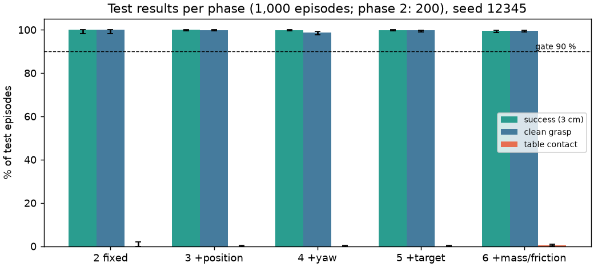
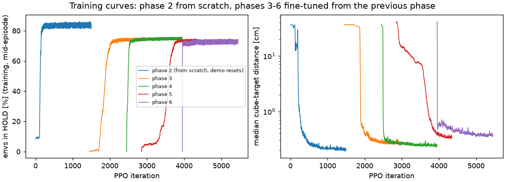
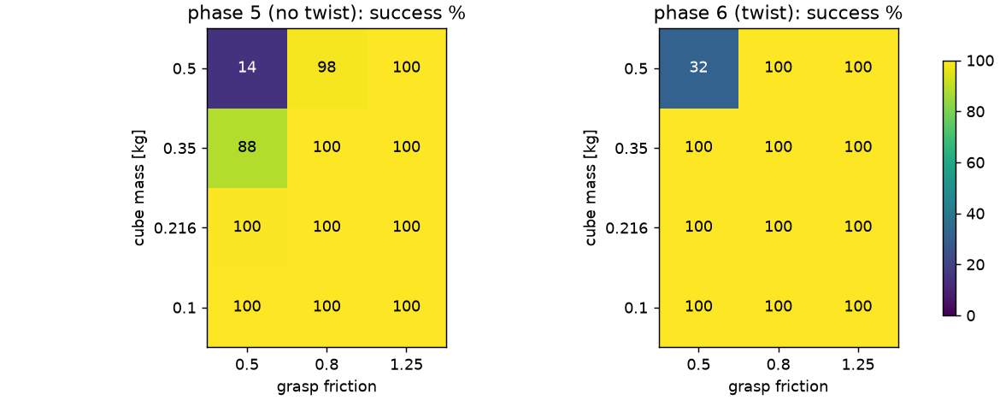

# Results: Franka cube lift with PPO (Isaac Lab 3, Newton physics)

A Franka Panda learns to pick up a cube, lift it and carry it to a target, trained with PPO (rsl_rl) in Isaac Lab 3.0
(lightweight mode, Newton / MuJoCo-Warp physics) on one RTX 4060 laptop GPU.

**How it is set up** (read this before the numbers):
- **The arm is learned; the claw is a reflex.** The gripper closes when the hand is in the "sweet spot" (vertical,
  aligned with two cube faces, fingertips at mid-cube height), stops at pressure, and holds a fixed small squeeze.
- **Arm actions are Cartesian deltas via IK.** The policy outputs fingertip dx, dy, dz (<= 1 cm per step) and a yaw
  step (<= 3 deg); a damped-least-squares IK turns them into the 7 joint-position targets and keeps the hand vertical.
- **Training used demonstration-state resets** for the first (fixed-world) policy: half of the training episodes
  started from a recorded state of a hand-written controller. The policy itself is learned only by PPO. Every
  evaluation starts from the robot's normal start pose.
- **One phase machine** (HOVER -> DESCEND -> CLOSE -> LIFT -> CARRY -> HOLD) drives the reward, observations, gripper
  reflex and evaluation, so the policy sees everything the reward uses.

## Final policy (phase 6: everything randomized)
Full variation: cube position (x +-0.10 m, y +-0.25 m) and yaw (+-pi), random target (x 0.4-0.6, y +-0.25,
z 0.25-0.5 m), cube mass 0.1-0.5 kg and grasp friction 0.5-1.25.

1,000 test episodes, seed 12345, 95 % Wilson CIs:

| success (cube within 3 cm of target at the end) | clean grasp | table contact | slam | jam | median final distance |
|---|---|---|---|---|---|
| **99.5 %** [98.8, 99.8] | **99.6 %** [99.0, 99.8] | 0.3 % [0.1, 0.9] | 0.3 % | 0.0 % | 1.24 mm |

**Metric definitions:**
- **success:** cube center within 3 cm of the target at the end, not touching the table
- **clean grasp:** top-down, both finger pads on the cube at lift-off, no palm contact, no robot-table contact > 20 N
- **slam:** hand/finger-table force > 20 N
- **jam:** cube wedged against the palm or riding on the arm

## The curriculum: one change per phase, each fine-tuned from the previous phase
| phase | world | test episodes | success | clean | table contact |
|---|---|---|---|---|---|
| 1 | hand-written controller (reference, no RL): random cube pose + target, 5 s episodes | 1,000 | 95.6 % | 100 % | 0 % |
| 2 | fixed cube, fixed target (trained from scratch) | 200 | 100 % [98.1, 100] | 100 % | 0 % |
| 3 | + cube position | 1,000 | 100 % [99.6, 100] | 99.9 % | 0 % |
| 4 | + cube yaw | 1,000 | 99.9 % [99.4, 100] | 98.7 % | 0 % |
| 5 | + random target | 1,000 | 99.9 % [99.4, 100] | 99.7 % | 0 % |
| 6 | + cube mass / friction | 1,000 | 99.5 % [98.8, 99.8] | 99.6 % | 0.3 % |

Phase 1's controller ran 5 s episodes with speed caps, so its misses are carries that hadn't finished in time. All
learned phases use 8 s episodes.

## Seeds (phase 2 repeated from scratch)
Same setup, trained from scratch three times; each checkpoint was picked on validation seeds before a 200-episode test (seed 12345) in the fixed world:

| training seed | success | clean | table contact | median final distance |
|---|---|---|---|---|
| 1 | 100 % [98.1, 100] | 100 % | 0 % | 0.45 mm |
| 2 | 100 % [98.1, 100] | 100 % | 0 % | 0.45 mm |
| 3 | 100 % [98.1, 100] | 100 % | 0 % | 0.61 mm |

In all three, validation success first passed 90 % at iteration ~200. Phases 3-6 were fine-tuned once each (one seed).

## Twist: does training with mass/friction randomization help?
Both final policies (phase 5: trained without mass/friction randomization; phase 6: with it) on the full-variation world with the cube mass and grasp friction fixed per cell, 200 episodes per cell. Success %, phase 5 -> **phase 6**:

| cube mass \ friction | 0.5 | 0.8 | 1.25 |
|---|---|---|---|
| 0.1 kg | 100.0 -> **100.0** | 100.0 -> **100.0** | 100.0 -> **100.0** |
| 0.216 kg | 99.5 -> **100.0** | 100.0 -> **100.0** | 100.0 -> **100.0** |
| 0.35 kg | 88.5 -> **100.0** | 100.0 -> **100.0** | 100.0 -> **100.0** |
| 0.5 kg | 14.5 -> **31.5** | 98.5 -> **100.0** | 100.0 -> **100.0** |

- Phase 6 is at least as good as phase 5 in every cell.
- It helps where the cube is heavy and slippery: 0.35 kg / friction 0.5 goes from 88.5 % to 100 %, and 0.5 kg / friction 0.5 from 14.5 % to 31.5 %.
- The last cell stays hard for both, and that is a limit of the gripper rule, not of the policy:
  - the reflex holds a fixed 3 mm squeeze, about 6 N per pad
  - 2 pads x 6 N x friction 0.5 is barely above the 4.9 N weight of a 0.5 kg cube

## What did not work (and why), in order
Earlier attempts with joint-space actions never reached the grasp:
1. **Speed gate.** A per-step reward paid only below a speed limit made freezing optimal.
2. **Noise floor.** A 0.2 action-noise floor made the sweet spot physically unreachable. Tested with a perfect
   controller plus noise: 0 % reach it.
3. **Tilt.** The policy tilted the hand, because nothing paid for staying vertical.
4. **Penalty-zone edge.** It parked at the edge of a slow-down zone, because joint-space noise makes the fingertip
   jitter.

Then with task-space actions:

5. **Retreat.** It retreated from the table, because the approach reward was flat far away.
6. **Short carries.** It learned to grasp but never reached the target, because it never experienced the target region.

The fixes were:
- task-space actions
- a long-range approach term
- a bounded exploration std
- demonstration-state resets

## Reproduce
- Environments: `lift_rl/phased_cfg.py`
  - `LiftRL-Phased-Fixed-TS-Demo-v0` for training phase 2
  - `LiftRL-Phased-P3-TS-v0` ... `P6` for the later phases
- Training: `scripts/train.py`
- Checkpoint pick on validation seeds: `scripts/score_checkpoints.py`
- Test: `scripts/evaluate.py`
- Videos: `scripts/phased_videos.py`
- Figures: `scripts/make_figures.py`
- Twist grid: `scripts/twist_grid.py`

Videos: see [videos/INDEX.md](videos/INDEX.md).
